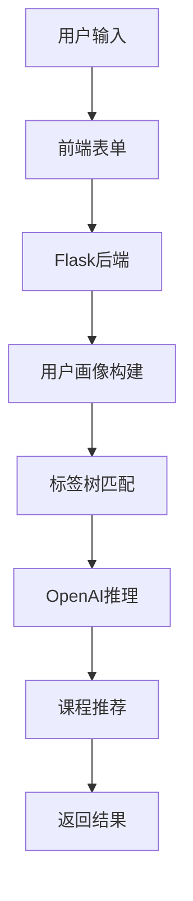

# 用户画像与课程推荐系统方案文档

## 方案概述

基于汇川技术公司技术星球平台用户行为数据，构建用户画像标签体系，实现精准课程推荐。采用粗标签+精确标签的树状结构，使用OpenAI API进行向量嵌入和大模型推理，确保标签可控、可管理。

## 核心问题与解决方案

### 现有标签体系不足
- 标签粒度不一致，无法精确匹配用户需求（如SV660故障判断）。
- 标签重复、同义词导致推荐不一致。
- 缺乏标准化管理，易发散。

### 改进方案
1. **标签树结构**：粗标签固定，精确标签动态。
2. **OpenAI集成**：使用embeddings for 向量相似度，chat for 推理结构。
3. **前后端架构**：Flask后端，HTML前端，支持网页输入。
4. **评估机制**：月度人工抽检，业务价值评估。

## 标签体系架构

### 标签来源属性
1. 身份基础属性：年龄、性别、从业年限
2. 岗位职业属性：岗位层级、核心职能
3. 技术专业属性：核心技术领域、技能熟练度
4. 平台行为属性：活跃度、浏览记录、板块评论、搜索记录

### 用户标签层次
- **身份岗位标签**：初级工程师等
- **岗位职能标签**：PLC工程师等
- **核心产品标签**：汇川PLC系列等
- **核心技术标签**：故障排查等
- **技能层级标签**：零基础等
- **学习成长标签**：学习目的、习惯、付费意愿

### 标签树示例
```
用户画像标签树
├── 身份标签
│   └── 初级工程师
├── 岗位职能
│   ├── 变频器维护师
│   └── 伺服调试
├── 核心产品
│   ├── 汇川通用技术用户
│   └── 汇川通用伺服产品
│       └── SV660
├── 核心技术
│   ├── IO模块
│   └── 通信模块
│       └── EtherCAT通信
├── 技能层级
│   ├── 入门
│   └── 资深
└── 学习成长
    ├── 碎片化学习
    └── 图文教学
```

## 标签构建流程

1. **初始化标签树**：构建层次化标签树，粗标签固定，精确标签动态。随机选择部分结构进行LLM推理，确保结构一致性。
2. **用户标签提取**：从用户数据提取关键词标签。
3. **LLM推理**：使用OpenAI chat基于随机样本结构推理用户标签结构。
4. **相似度匹配**：用向量模型+关键词加权计算相似度，匹配已有标签。
5. **路径匹配**：
   - **完全匹配路径**：强关键词匹配，防止遗漏。
   - **最大匹配路径**：找到最相似路径，在路径下新增节点，避免树过宽。
6. **融合精确标签**：合并相似标签，保证一致性。
7. **新增节点**：不相似标签新增根节点。
8. **标签管理**：支持批量增删改查。

## 用户画像生成

用户生成标签后，每层与标签树匹配，输出匹配到的标签字典。

## 课程推荐逻辑

推荐 = 粗标签过滤 + 精确标签精准匹配

- **粗标签过滤**：根据用户身份、岗位职能筛选候选课程。
- **精确标签匹配**：基于产品型号、技术细节计算匹配度。
- **排序**：结合学习习惯、付费意愿排序推荐结果。

## 技术实现

- **编程语言**：Python
- **核心库**：pandas、networkx、openai、flask
- **数据存储**：CSV for 数据，NetworkX for 树
- **API**：OpenAI embeddings & chat

## 前后端架构

- **后端**：Flask API，提供/profile和/recommend端点。
- **前端**：HTML表单，AJAX提交数据，显示结果。

## 评估指标

1. **准确性**：月度人工抽检，准确率≥95%
2. **业务价值**：推荐转化率、用户满意度、课程完成率

## 方案框架图



## 方案流程图

```mermaid
flowchart TD
    start[开始] --> input[用户输入数据]
    input --> preprocess[预处理]
    preprocess --> embed[OpenAI嵌入]
    embed --> match[相似度匹配]
    match --> llm[LLM推理结构]
    llm --> profile[生成画像]
    profile --> recommend[推荐课程]
    recommend --> output[输出结果]
    output --> end[结束]
```